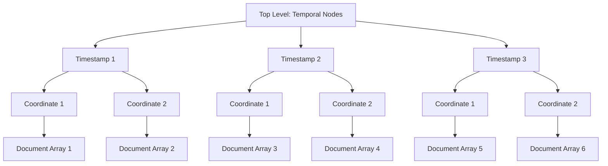

# Description

Repository to practice refactoring of a c project. The project has configured a CI pipeline in Jenkins that executes the unit tests and measures the quality of the code using sonarqube.

To install and configure the Jenkins server, please refer to [https://github.com/panizolledotangel/docker_jenkins_sonar_c](https://github.com/panizolledotangel/docker_jenkins_sonar_c)

# Requisites

* C compiler like gcc.
* Cmake ([https://cmake.org/](https://cmake.org/))

# Compile

```
mkdir build
cd build
cmake ..
make
```

# Pass the test

After compiling execute the next command from the build folder

```
ctest --verbose
```

# Project Overview

The project is an app that tracks the position of people overtime and then is capable of indicating the people that have been near one particular person in a lapsus of time.

The idea is that the app opens an API with all the functionality. However the project has a simple command line to test the basic functionality.

To run the aplication, a csv file with the contact information of the users being tacked must be passed as an argument. An example file is given below:

```
name,surname,cp,email,document,address,birthday
harry,potter,28057,harry.potter@upm.es,49001567,C/Privet Drive,01/01/1991
bob,smith,28048,bob.smith@upm.es,37001567,C/Baker Street,05/05/1992
jane,doe,28049,jane.doe@upm.es,27001567,C/Fleet Street,12/12/1989
```

Once the file is loaded users can interact with it using commands: add new data entries (person X is at coordinate Y at time T), query contact information between dates (who has being in contact with person X between time T1 and T2 ), view the date range of the data (what posible timestamps are stored in the system), and exit the application.

# Aplication design

The aplication has this modules.

* Users contact information:
    * `csv.c/h`: Module that handle the processing of csv files.
    * `person.c/h`: Module that stores the information of a single person as well as a set of ones. Allows checking if someone is in a set of people using its document, adding people to a set, making a copy of person ... etc.
* User tracking:
    * `api.c/h`: expose all the functionality of the app. Contains all the information about the contact information of an user as well as the tracking information. More information of the tracking the next section.
    * `temporal_node.c/h`: Node that stores the tracking information for a single timestamp. Contains information about the location of people in that single time stamp.
    * `coordinate_node.c/h`: Node that stores the tracking information for a single timestamp and a single coordinate. Contains a list of documents of the people in that coordinate in a particular timestamp.
* Miscelaneous:
    * `date.c/h`: Stores datetimes and allows compare them.
    * `error.h`: Stores different types of errors the aplication can return.

## Tracking data structure

The data structure to track the users is a two level linked list. In the frist level we have the different timestamps tracked ordered in ascending order. In the second level, we have a list of coordinates for each timestamp. Finally, for each coordinate we have an array with the documents of the people in that coordinate during a particular timestamp.

The data structure to track the users is a two-level linked list:

1. **Top Level (Temporal Nodes)**: Managed by the `api` module.
    - **Node (Timestamp)**: Each node represents a timestamp.
    - **Next Temporal Node**: Points to the next timestamp in ascending order.

2. **Mid Level (Coordinate Nodes)**: Each `temporal_node` contains a linked list of coordinates.
    - **Node (Coordinate)**: Each node represents a coordinate for a specific timestamp.
    - **Next Coordinate Node**: Points to the next coordinate node for the same timestamp.

3. **Lowest Level (Documents)**: Each `coordinate_node` contains an array of documents.
    - **Array of Documents**: Stores the documents of people present at that coordinate during the timestamp.

Here’s a diagram to visualize this structure:


The lowest level of the data structure, the one that stores the people in a particular coordinate, is managed by the `coordinate_node` module. The documents of the people in that coordinate are stored in a dinamic array. The mid level of the data structure, the one that stores all the people in different coordinates on the same timestamp, is manger by the `temporal_node` module. This module has a linked list of `coordinate_node` and is in charge of updating that linked list. Finally, the highest level of the data structure is manage by the `api` module. This module has a linked list of `temporal_node` and is in charge of correctly updating that linked list, i.e. maintain the order of the temporal nodes, as well as quering the data structure to find the contacts of a person, the range of dates stored ... etc.
